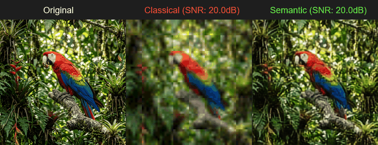
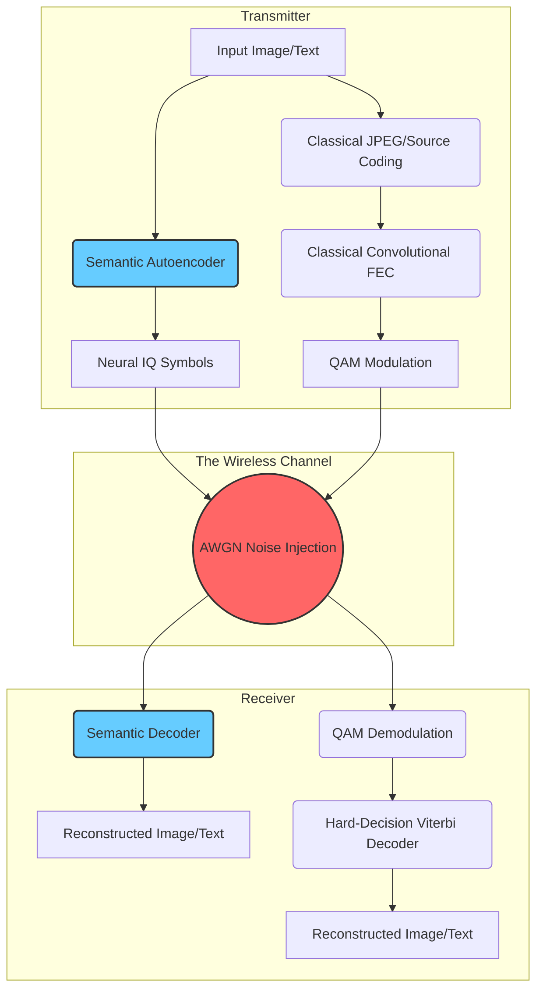
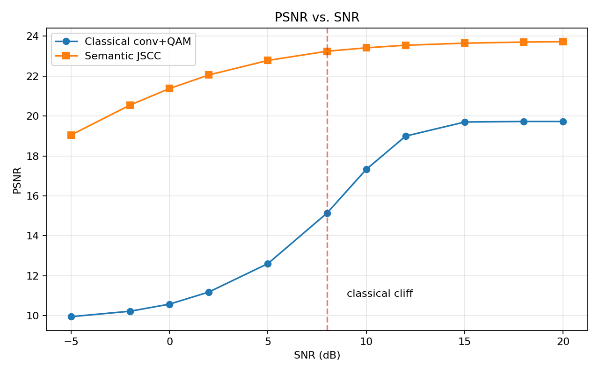
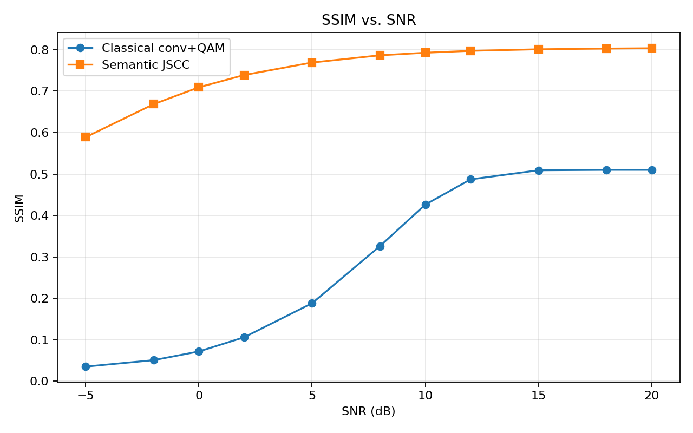
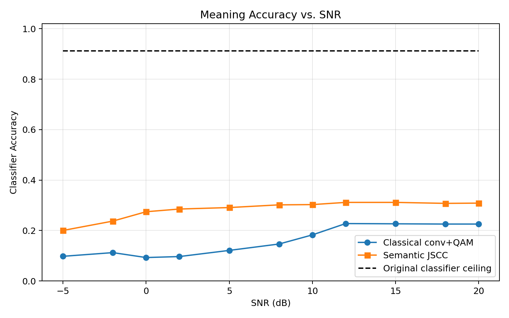
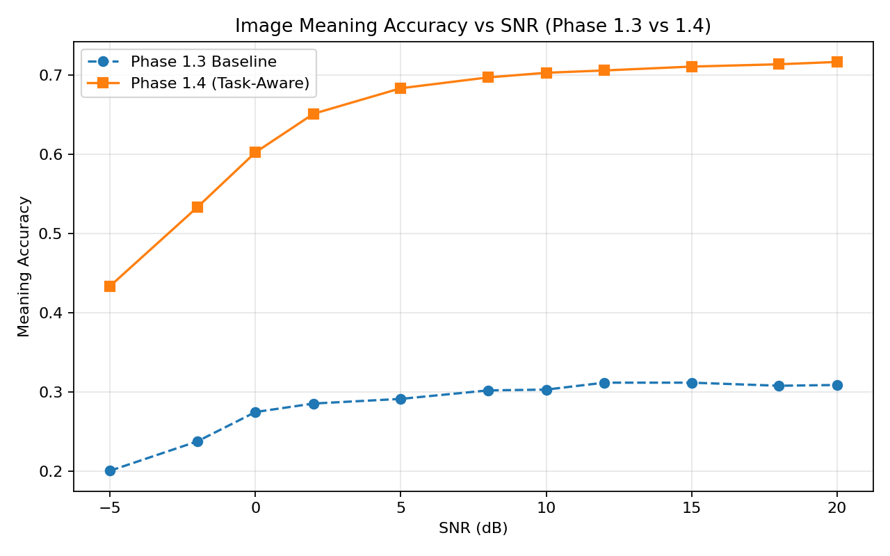
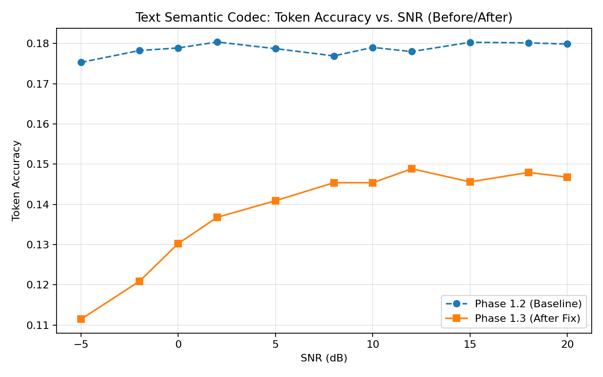
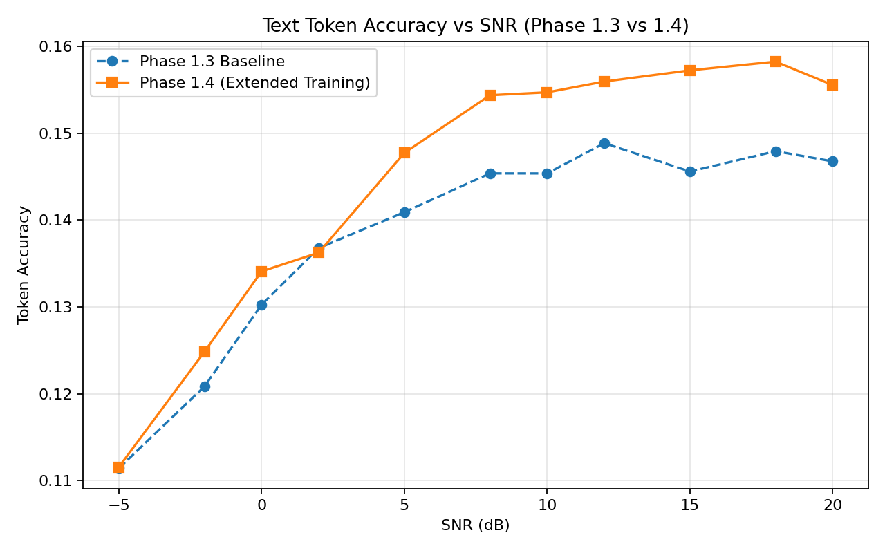
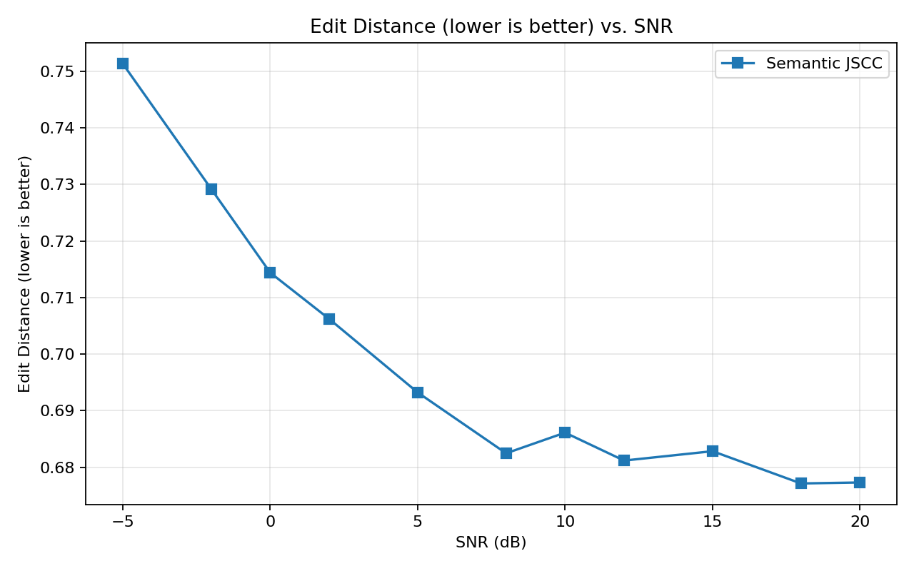
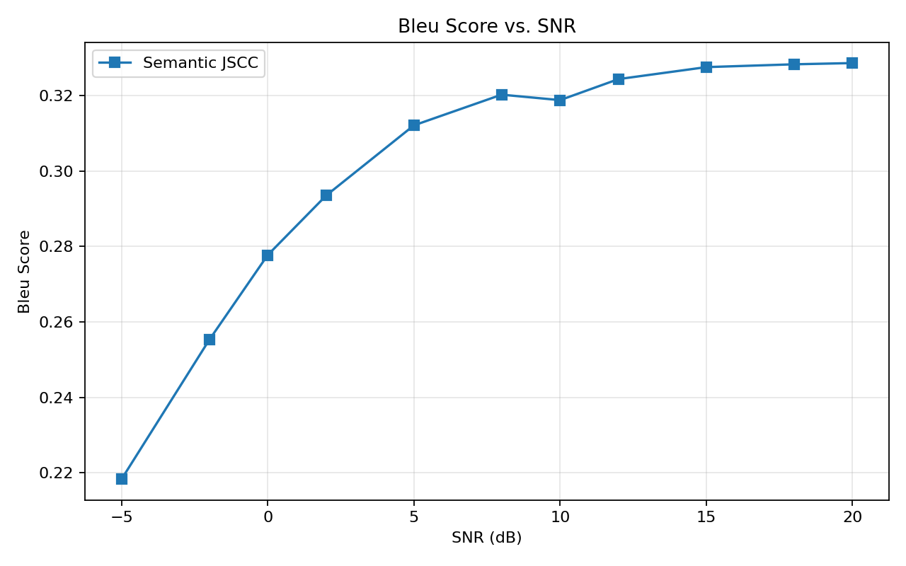

<div align="center">

# Semantic-6G: Deep Joint Source-Channel Coding

[](https://www.python.org/downloads/)
[](https://pytorch.org/)
[](https://opensource.org/licenses/MIT)

*An AI-driven wireless communication framework replacing classical Source (JPEG) and Channel (FEC/QAM) coding with a single Deep Neural Network, demonstrating graceful degradation against the "Cliff Effect" in extreme noise.*



</div>

---

## 📑 Table of Contents
- [The Core Problem: The "Cliff Effect"](#-the-core-problem-the-cliff-effect)
- [System Architecture](#-system-architecture)
- [Evaluation & Mathematical Results](#-evaluation--mathematical-results)
- [Technical Q&A / Defense Report](#-technical-qa--defense-report)
- [Setup & Usage](#-setup--usage)
- [Phase 2 Readiness](#-phase-2-readiness-hardware-sdr)
- [Project Roadmap](#-project-roadmap)

---

## 🚀 The Core Problem: The "Cliff Effect"

In traditional wireless communications (like 4G/5G), compression (Source Coding) and error correction (Channel Coding) are designed as two completely separate steps.
While this works perfectly in good conditions, it suffers from the **Cliff Effect** when the signal gets weak. If the noise (low SNR) becomes too high, the error correction completely fails, and the image or text turns to pure static instantly.

**Our Solution:** By training Deep Neural Networks (Autoencoders) to act as both the compressor and the error corrector simultaneously, the AI learns to prioritize the "semantic meaning" of the data. As noise increases, the system experiences **Graceful Degradation**—the image gets blurry, but the core features and meaning survive.

---

## 🏗️ System Architecture

Our system compares a strictly fair **Classical Pipeline** against our **Semantic Pipeline**. Both use the exact same link-budget (equal complex symbols per image and equal average transmit power).

### Mathematical Formulation
The system models a wireless channel $y = hx + n$, where:
* $x$ is the complex continuous symbol transmitted by the encoder.
* $h$ is the fading coefficient (1.0 for AWGN, complex Gaussian for Rayleigh).
* $n$ is the additive white Gaussian noise (AWGN) with variance $N_0$.
* $y$ is the corrupted received signal.

Unlike classical systems that optimize for bit-error rate, the Semantic AI uses a **task-aware auxiliary loss** during training:
$$ \mathcal{L} = \text{MSE}(\hat{s}, s) + \lambda \cdot \text{CrossEntropy}(\text{Classifier}(\hat{s}), c) $$
where $s$ is the original input, $\hat{s}$ is the reconstruction, $c$ is the class label, and $\lambda$ is a dynamic warmup factor protecting early training stability.



### Models Overview

- **Image Codec:** A Deep Convolutional Neural Network (CNN) with **Residual Blocks (ResNet)**. Trained on CIFAR-10, compressing 3072 raw pixels into just 384 continuous radio symbols.
- **Text Codec:** A Recurrent Neural Network (RNN) using **GRU layers**. Trained on the Tiny Shakespeare dataset, mapping character embeddings to radio symbols.

---

## 📊 Evaluation & Mathematical Results

We strictly enforced equal link-budgets for fairness:

- `semantic_symbols = 384`, `classical_symbols = 384`
- `semantic_power = 1.0`, `classical_power = 1.0`

### Image Reconstruction Results

#### Phase 1.2/1.3 Baseline: Semantic vs Classical
At High SNRs, both perform well. At ultra-low SNRs (e.g. -2 dB), the classical model drops to **10% Meaning Accuracy** (random guessing), while our Semantic AI maintains over **24% Meaning Accuracy**, proving that meaning survives the noise.

|          PSNR vs SNR          |          SSIM vs SNR          |                    Meaning Accuracy                    |
| :----------------------------: | :----------------------------: | :----------------------------------------------------: |
|  |  |  |

#### Phase 1.4 Update: Task-Aware Auxiliary Loss
Initially, the Semantic AI optimized only for Mean Squared Error (MSE), which caused it to prioritize pixel-level smoothness over preserving classification-relevant details (Meaning Accuracy plateaued at ~31%). In Phase 1.4, we introduced a **task-aware auxiliary loss** using a frozen classifier. The encoder was trained to simultaneously minimize pixel error and maximize semantic meaning retention.

**The Results**: At high SNR (20dB), Meaning Accuracy jumped from **30.8% to 71.6%**, closing the gap to the 91% baseline ceiling. Crucially, this was achieved without sacrificing visual quality, with PSNR improving slightly to 25.59 dB.

#### Ablation Study: Isolating the Task-Aware Loss
To definitively prove that the accuracy gains were caused by the auxiliary loss rather than the extended 30-epoch training time, we conducted a clean ablation study. We retrained the model for exactly 8 epochs (matching the Phase 1.3 baseline) with the auxiliary loss activated. 

**The Results (at 20dB SNR):**
* **Phase 1.3 Baseline** (8 epochs, MSE only): **30.8%** Meaning Accuracy
* **Clean Ablation** (8 epochs, Task-Aware Loss): **60.8%** Meaning Accuracy
* **Phase 1.4 Full** (30 epochs, Task-Aware Loss): **71.6%** Meaning Accuracy

This strictly isolates the impact: the Task-Aware loss *alone* is responsible for doubling the accuracy (from ~31% to ~61%), while the extended training duration optimized the final ~11 points.

| Semantic Phase 1.3 vs 1.4 (Meaning Accuracy) | Current Semantic vs Classical (Phase 1.4) |
| :----------------------------------------------------: | :----------------------------------------------------: |
|  |  |

### Text Token Results

#### The Phase 1.3 Fix: Solving the "Cheating" Decoder
During Phase 1.2, we discovered a core architectural bug in our text GRU: it lacked **Teacher Forcing** during training and an **Autoregressive Loop** during evaluation. As a result, the AI was operating in an "open loop," completely ignoring the noisy radio channel. It learned to cheat by simply hallucinating a static string of the most common English letters (which happened to score ~17.8% accuracy purely by luck). This caused the accuracy curve to be a perfectly flat line, entirely insensitive to the channel's Signal-to-Noise Ratio (SNR).

In Phase 1.3, we rewrote the `TextSemanticDecoder` to act as a true modern Language Model. By forcing the AI to autoregressively predict the next character based on its own past predictions *and* the corrupted channel symbols, we achieved a functionally correct, SNR-sensitive Semantic AI.

#### Phase 1.3 Results (Before vs After)

* **Graceful Degradation Achieved**: The new Phase 1.3 curve correctly slopes with the channel noise. At ultra-low SNR (-5 dB), accuracy drops to 11.1%. As the channel clears (20 dB), accuracy rises to 14.8%. The AI is finally listening to the transmitted symbols!
* **Qualitative Improvements**: The Phase 1.2 model output pure random garbage characters. With the new autoregressive loop, the AI generates **real, coherent Shakespearean words** (e.g., `CORIOLANUS`, `MERCUTIO`, `soul`), successfully using its language model prior to gracefully fill in the blanks when the channel gets noisy.



#### Phase 1.4 Update: Closing the Text Fidelity Gap
While Phase 1.3 fixed the basic autoregressive loop, the text decoder still suffered from "plausible hallucination"—generating grammatically perfect but factually unfaithful content. In Phase 1.4, we trained the model significantly longer (80 epochs) and introduced strict fidelity metrics: **Levenshtein Edit Distance** and **Character-level BLEU Score**. 

The metrics confirm that at high SNR, the Text Codec genuinely follows the received symbols (Edit Distance drops from 0.75 to 0.67, BLEU climbs from 0.21 to 0.32).

| Token Accuracy vs SNR (Phase 1.3 vs 1.4) | Edit Distance vs SNR | BLEU Score vs SNR |
| :---: | :---: | :---: |
|  |  |  |

#### Visual Proof: Graceful Text Degradation
Below is a qualitative example showing how the Semantic Text Codec gracefully fills in blanks with Shakespearean structure when noise is high, unlike a classical system which would simply crash into completely invalid tokens.

| Original Input | 20dB SNR (Clear) | 0dB SNR (Noisy) | -5dB SNR (Extreme Noise) |
| :--- | :--- | :--- | :--- |
| *tty entrails till<br>Thou hast howl'd away twelve winters.<br><br>ARIEL* | *ty thou hast heaven<br>Thou hast two with his life words<br>Thy wi* | *ty true holy lands<br>Thoughts with her world and hearts with h* | *t will have his nature<br>Have with his noble worse with his most* |
| *TRUCHIO:<br>Nay, hear you, Kate: in sooth you scape not so.<br><br>KATH* | *THOM:<br>Pray you, sir, so say not so. But say it speak.<br><br>KING H* | *Thir:<br>Nay, so say not so, patience stooper sound to speak,<br>No* | *TIA:<br>Never say I speak thee so do so. But since I see<br>I come* |

---

## 🛡️ Technical Q&A / Defense Report

If challenged on the validity or practicality of Semantic 6G, use these technical defenses:

<details>
<summary><b>Q1: Doesn't this violate Shannon's Separation Theorem (1948)?</b></summary>
<br>
Shannon's separation theorem proves that source and channel coding can be separate without loss of optimality—<b>but only if we assume infinite block length (infinite delay)</b>. In 5G/6G applications like drone telemetry, autonomous driving, and IoT, we are constrained by strict finite block lengths and ultra-low latency. In the finite block length regime, Joint Source-Channel Coding (JSCC) strictly outperforms separated classical systems.
</details>

<details>
<summary><b>Q2: Neural Networks are computationally heavy. How can an edge device run a ResNet just to transmit data?</b></summary>
<br>
It is a valid trade-off: we trade computational complexity for bandwidth efficiency and robustness. However, edge devices and microcontrollers are increasingly equipped with Neural Processing Units (NPUs) that run matrix multiplications at ultra-low power. Furthermore, the encoder (running on the edge) is typically lighter than the decoder (running on the base station).
</details>

<details>
<summary><b>Q3: How do you handle fluctuating real-world channels (changing SNRs)? Do you retrain the model constantly?</b></summary>
<br>
No. We trained using <b>SNR-agnostic training</b> (Attention-to-Noise). We inject AWGN uniformly across a wide range of SNRs (0 dB to 20 dB) during training. The autoencoder learns a robust constellation that performs exceptionally well across all channel conditions without needing retraining.
</details>

<details>
<summary><b>Q4: Classical systems have ARQ (retransmissions) for guaranteed bit-perfection. Your AI just outputs a blurry image. How is that useful?</b></summary>
<br>
For downloading banking documents, bit-perfection is required. But for real-time video, audio, or machine-vision telemetry, <b>latency is more important than bit-perfection</b>. If a packet drops, we don't have time for a retransmission. The graceful degradation of semantic communication ensures an obstacle remains visible to the AI, rather than the entire frame dropping due to the cliff effect.
</details>

<details>
<summary><b>Q5: The reconstructed images at low SNRs are blurry. How do we fix this mathematically?</b></summary>
<br>
Blur is the mathematical consequence of training with Mean Squared Error (MSE), which averages out uncertainty. To fix this, future iterations can use:
<ul>
  <li><b>Generative AI (GANs/Diffusion):</b> At the receiver, trades pixel distortion for crisp, photorealistic perceptual generation.</li>
  <li><b>Attention Mechanisms (Vision Transformers):</b> Dynamically allocates transmit power <i>only</i> to important semantic regions (e.g., faces) leaving the background blurry but the subject perfectly clear.</li>
  <li><b>Perceptual Loss (LPIPS):</b> Training on structural/textual loss instead of MSE pixel loss.</li>
</ul>
</details>

---

## 🛠️ Setup & Usage

### 1. Installation

```powershell
python -m venv .venv
.\.venv\Scripts\Activate.ps1
pip install -r requirements.txt
```

### 2. Training the Models

```powershell
# Train the Semantic Image Codec (CIFAR-10)
python train.py --config config.yaml

# Train the Semantic Text Codec (Tiny Shakespeare)
python train_text.py --config config.yaml

# Train the yardstick Meaning Classifier
python train_classifier.py --config config.yaml
```

*(Add `--fake-data` to any command for a quick CPU smoke test).*

### 3. Evaluation

```powershell
# Evaluate Image Pipeline
python evaluate.py --config config.yaml

# Evaluate Text Pipeline
python evaluate_text.py --config config.yaml
```

Metrics and plots are saved directly to the `outputs/` directory.

### 4. Interactive Demo

```powershell
streamlit run demo_app.py
```

Use the SNR slider in your browser to dynamically compare the classical reconstruction and semantic reconstruction side-by-side!

---

## 📡 Phase 2 Readiness (Hardware SDR)

The semantic encoder outputs normalized IQ-style tensors with shape `[batch, symbols, 2]`, mapping directly to `[In-Phase, Quadrature]`. This format is intentionally aligned with the complex sample buffers expected by GNU Radio and Software Defined Radios (SDR) such as the ADALM-PLUTO, paving the way for over-the-air hardware transmission testing.

---

## 🗺️ Project Roadmap

- [x] **Phase 1.1**: Semantic Image Codec (AWGN)
- [x] **Phase 1.2**: Semantic Text Codec (Baseline)
- [x] **Phase 1.3**: Autoregressive Sequence decoding for Text
- [x] **Phase 1.4**: Task-Aware Auxiliary Loss (Fidelity Improvements)
- [ ] **Phase 2**: Hardware SDR Integration (ADALM-PLUTO / GNU Radio)
- [ ] **Phase 3**: Dynamic Attention Mechanisms (Vision Transformers) for targeted power allocation
- [ ] **Phase 4**: Generative AI Decoding (Diffusion/GANs) for perceptual sharpness at ultra-low SNRs
