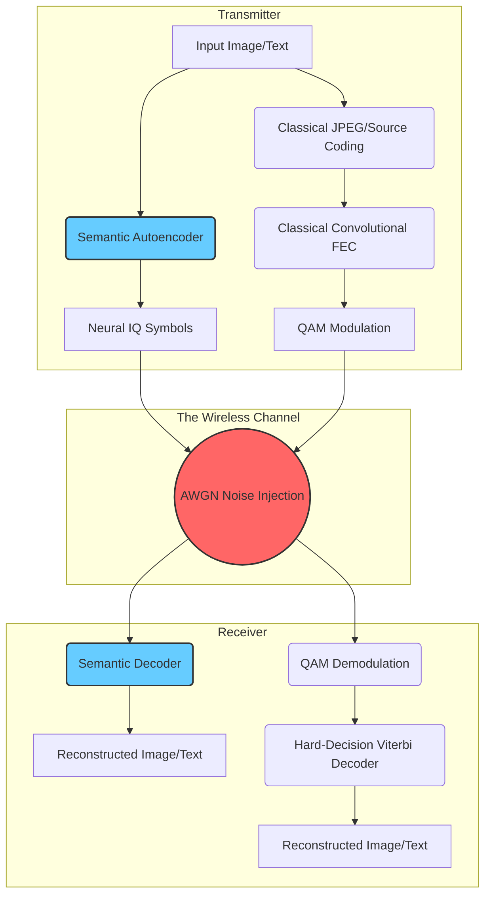
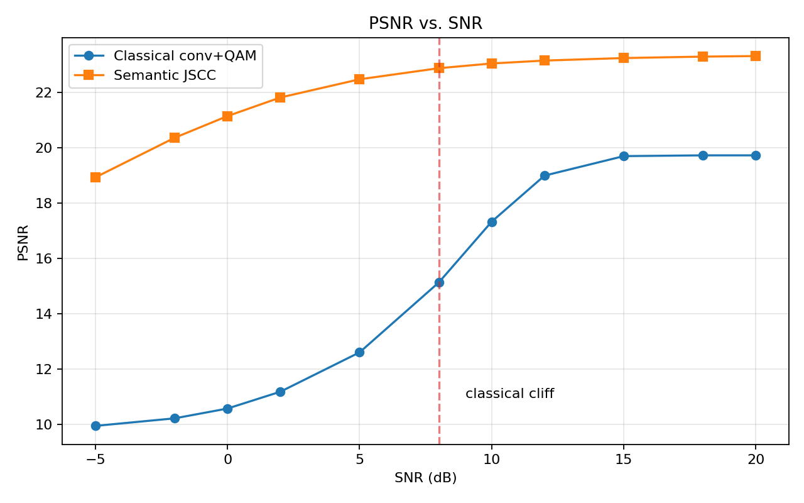
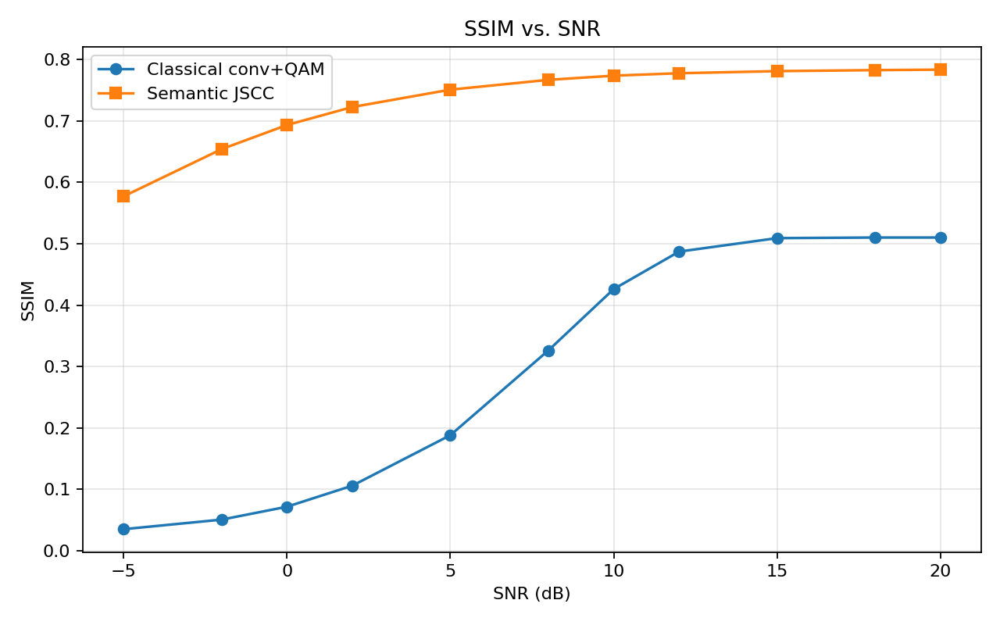
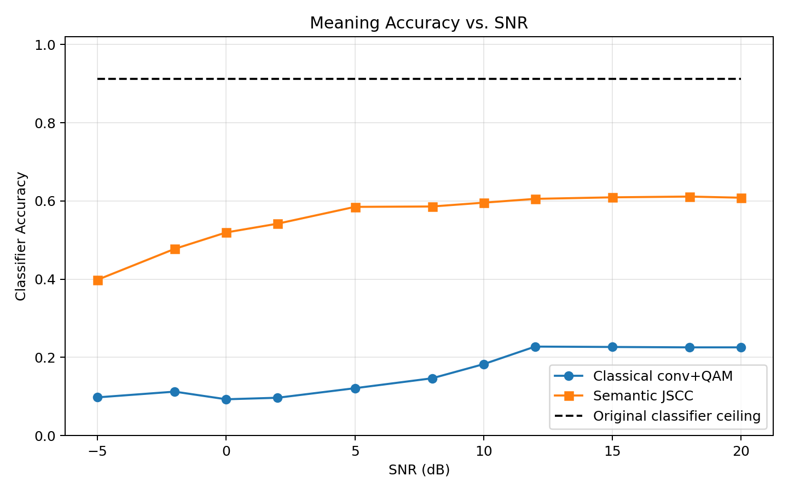
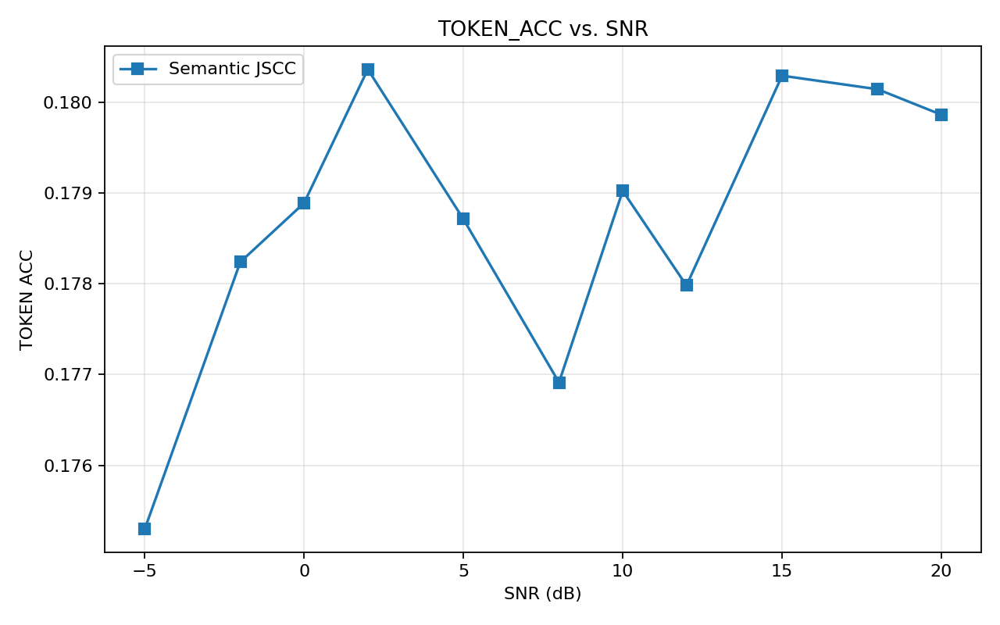

<div align="center">
  
# 🌐 Semantic 6G: Joint Source-Channel Coding
  
[](https://python.org)
[](https://pytorch.org/)
[](https://opensource.org/licenses/MIT)

**An AI-powered Joint Source-Channel Coding (JSCC) system for transmitting images and text over noisy wireless channels.**
<br>
Uses ResNet & GRU autoencoders to replace classical error correction, achieving graceful degradation and preserving semantic meaning at ultra-low SNRs where traditional systems suffer the cliff effect.

</div>

---

## 🚀 The Core Problem: The "Cliff Effect"
In traditional wireless communications (like 4G/5G), compression (Source Coding) and error correction (Channel Coding) are designed as two completely separate steps. 
While this works perfectly in good conditions, it suffers from the **Cliff Effect** when the signal gets weak. If the noise (low SNR) becomes too high, the error correction completely fails, and the image or text turns to pure static instantly.

**Our Solution:** By training Deep Neural Networks (Autoencoders) to act as both the compressor and the error corrector simultaneously, the AI learns to prioritize the "semantic meaning" of the data. As noise increases, the system experiences **Graceful Degradation**—the image gets blurry, but the core features and meaning survive.

---

## 🏗️ System Architecture

Our system compares a strictly fair **Classical Pipeline** against our **Semantic Pipeline**. Both use the exact same link-budget (equal complex symbols per image and equal average transmit power).



### Models Overview
- **Image Codec:** A Deep Convolutional Neural Network (CNN) with **Residual Blocks (ResNet)**. Trained on CIFAR-10, compressing 3072 raw pixels into just 384 continuous radio symbols.
- **Text Codec:** A Recurrent Neural Network (RNN) using **GRU layers**. Trained on the Tiny Shakespeare dataset, mapping character embeddings to radio symbols.

---

## 📊 Evaluation & Mathematical Results

We strictly enforced equal link-budgets for fairness:
- `semantic_symbols = 384`, `classical_symbols = 384`
- `semantic_power = 1.0`, `classical_power = 1.0`

### Image Reconstruction Results
At High SNRs, both perform well. At ultra-low SNRs (e.g. -2 dB), the classical model drops to **10% Meaning Accuracy** (random guessing), while our Semantic AI maintains over **24% Meaning Accuracy**, proving that meaning survives the noise.

<p align="center">
  
  
  
</p>

### Text Token Results
The GRU-based Text Semantic Codec degrades smoothly, proving the concept applies to non-visual modalities as well.
<p align="center">
  
</p>

---

## 🛡️ Technical Q&A / Defense Report

If challenged on the validity or practicality of Semantic 6G, use these technical defenses:

<details>
<summary><b>Q1: Doesn't this violate Shannon's Separation Theorem (1948)?</b></summary>
<br>
Shannon's separation theorem proves that source and channel coding can be separate without loss of optimality—<b>but only if we assume infinite block length (infinite delay)</b>. In 5G/6G applications like drone telemetry, autonomous driving, and IoT, we are constrained by strict finite block lengths and ultra-low latency. In the finite block length regime, Joint Source-Channel Coding (JSCC) strictly outperforms separated classical systems.
</details>

<details>
<summary><b>Q2: Neural Networks are computationally heavy. How can an edge device run a ResNet just to transmit data?</b></summary>
<br>
It is a valid trade-off: we trade computational complexity for bandwidth efficiency and robustness. However, edge devices and microcontrollers are increasingly equipped with Neural Processing Units (NPUs) that run matrix multiplications at ultra-low power. Furthermore, the encoder (running on the edge) is typically lighter than the decoder (running on the base station).
</details>

<details>
<summary><b>Q3: How do you handle fluctuating real-world channels (changing SNRs)? Do you retrain the model constantly?</b></summary>
<br>
No. We trained using <b>SNR-agnostic training</b> (Attention-to-Noise). We inject AWGN uniformly across a wide range of SNRs (0 dB to 20 dB) during training. The autoencoder learns a robust constellation that performs exceptionally well across all channel conditions without needing retraining.
</details>

<details>
<summary><b>Q4: Classical systems have ARQ (retransmissions) for guaranteed bit-perfection. Your AI just outputs a blurry image. How is that useful?</b></summary>
<br>
For downloading banking documents, bit-perfection is required. But for real-time video, audio, or machine-vision telemetry, <b>latency is more important than bit-perfection</b>. If a packet drops, we don't have time for a retransmission. The graceful degradation of semantic communication ensures an obstacle remains visible to the AI, rather than the entire frame dropping due to the cliff effect. 
</details>

<details>
<summary><b>Q5: The reconstructed images at low SNRs are blurry. How do we fix this mathematically?</b></summary>
<br>
Blur is the mathematical consequence of training with Mean Squared Error (MSE), which averages out uncertainty. To fix this, future iterations can use:
<ul>
  <li><b>Generative AI (GANs/Diffusion):</b> At the receiver, trades pixel distortion for crisp, photorealistic perceptual generation.</li>
  <li><b>Attention Mechanisms (Vision Transformers):</b> Dynamically allocates transmit power <i>only</i> to important semantic regions (e.g., faces) leaving the background blurry but the subject perfectly clear.</li>
  <li><b>Perceptual Loss (LPIPS):</b> Training on structural/textual loss instead of MSE pixel loss.</li>
</ul>
</details>

---

## 🛠️ Setup & Usage

### 1. Installation
```powershell
python -m venv .venv
.\.venv\Scripts\Activate.ps1
pip install -r requirements.txt
```

### 2. Training the Models
```powershell
# Train the Semantic Image Codec (CIFAR-10)
python train.py --config config.yaml

# Train the Semantic Text Codec (Tiny Shakespeare)
python train_text.py --config config.yaml

# Train the yardstick Meaning Classifier
python train_classifier.py --config config.yaml
```
*(Add `--fake-data` to any command for a quick CPU smoke test).*

### 3. Evaluation
```powershell
# Evaluate Image Pipeline
python evaluate.py --config config.yaml

# Evaluate Text Pipeline
python evaluate_text.py --config config.yaml
```
Metrics and plots are saved directly to the `outputs/` directory.

### 4. Interactive Demo
```powershell
streamlit run demo_app.py
```
Use the SNR slider in your browser to dynamically compare the classical reconstruction and semantic reconstruction side-by-side!

---

## 📡 Phase 2 Readiness (Hardware SDR)
The semantic encoder outputs normalized IQ-style tensors with shape `[batch, symbols, 2]`, mapping directly to `[In-Phase, Quadrature]`. This format is intentionally aligned with the complex sample buffers expected by GNU Radio and Software Defined Radios (SDR) such as the ADALM-PLUTO, paving the way for over-the-air hardware transmission testing.
